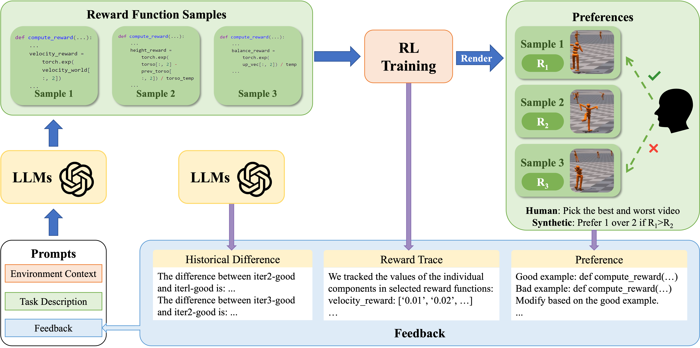

# Few-shot In-context Preference Learning using Large Language Models

This repository is the official codebase of "Few-shot In-context Preference Learning using Large Language Models". We propose In-Context Preference Learning (ICPL), a method that uses the grounding of an LLM to accelerate learning reward functions from preferences. 

# Installation
ICPL requires Python ≥ 3.8. 

1. Create a new conda environment with:
```
conda create -n icpl python=3.8
conda activate icpl
```

2. Install IsaacGym (tested with `Preview Release 4/4`). Follow the [instruction](https://developer.nvidia.com/isaac-gym) to download the package.
```	
tar -xvf IsaacGym_Preview_4_Package.tar.gz
cd isaacgym/python
pip install -e .
(test installation) python examples/joint_monkey.py
```

3. Install ICPL
```
git clone git@github.com:icpl-research/ICPL.git
cd ICPL; pip install -e .
cd isaacgymenvs; pip install -e .
cd ../rl_games; pip install -e .
```

4. ICPL currently uses OpenAI API for language model queries. You need to have an OpenAI API key to use ICPL [here](https://platform.openai.com/account/api-keys)/. Then, set the environment variable in your terminal
```
export OPENAI_API_KEY= "YOUR_API_KEY"
```

# Getting Started

Navigate to the `icpl` directory and run:
```
python icpl.py env={environment} iteration={num_iterations} sample={num_samples}
```
- `{environment}` is the task to perform. Options are listed in `icpl/cfg/env`.
- `{num_samples}` is the number of reward samples to generate per iteration. Default value is `6`.
- `{num_iterations}` is the number of ICPL iterations to run. Default value is `5`.

For using synthetic preferences, run:
```
python icpl.py preference_type='auto' env={environment} iteration={num_iterations} sample={num_samples}
```

For using sparse reward instead of preferences, run:
```
python icpl.py preference_type='no' use_sparse_reward=True user_list_only=False use_history_diff=False use_reward_trace=False env={environment} iteration={num_iterations} sample={num_samples}
```

Each run will create a timestamp folder in icpl/outputs that saves the ICPL log.

# Acknowledgement
We thank the following open-sourced projects:
- Our code is based on [Eureka](https://github.com/eureka-research/Eureka).
- Our environments are from [IsaacGym](https://github.com/NVIDIA-Omniverse/IsaacGymEnvs) and [DexterousHands](https://github.com/PKU-MARL/DexterousHands/).
- Our RL training code is based on [rl_games](https://github.com/Denys88/rl_games).

# License
This codebase is released under [MIT License](LICENSE).
